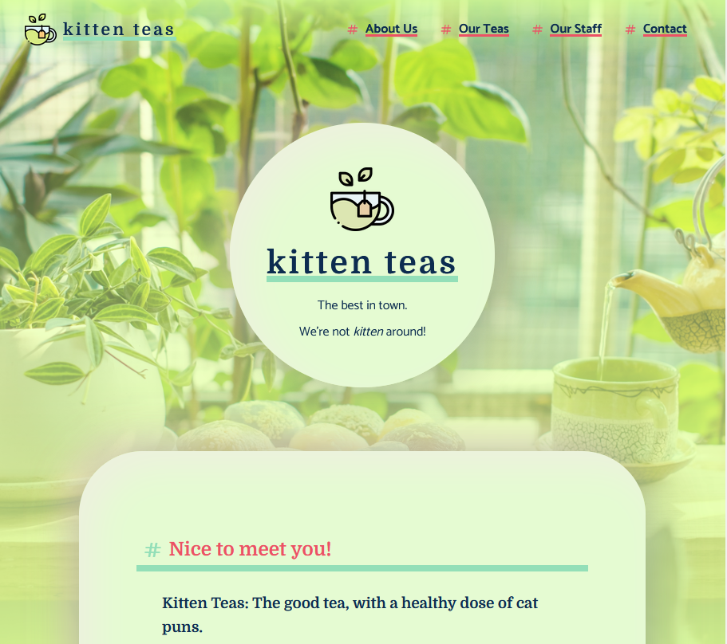

# Kitten Teas - Company Website

This is a project made during a Code Academy course. 🎉

## Overview

This project involved creating a fake company website page, being fully built in Flexbox and responsive. I decided to make a light-hearted and fun company website, named **Kitten Teas.** 🐱

This is static page, so there's no interactivity built for now. Which can change, of course, as I learn more JS! 💪🏽

**Credits:**
The Icons are from Phosphor Icons, the images used were chosen from free Stock Photos archives like Unsplash and StockSnap, and the logo is from Freepik.

## Images

## Changelog

- 1.0 - Initial commit.
